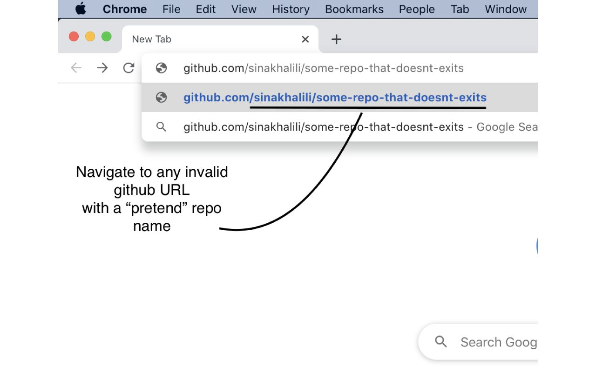
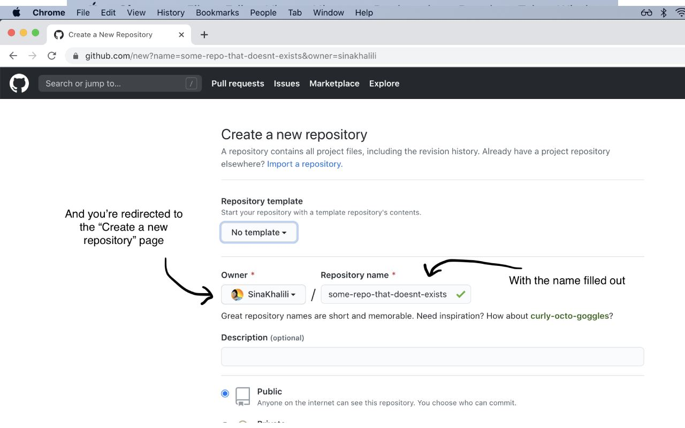

# github url to repo
Chrome Extension to go from Github's 404 page to the new repo page

## Usage

It's so easy, even a child's child could do it!

## Installing

Feel free to use it by "loading unpacked" and installing from source,
however the official extension is under review. Check back soon :heart:
